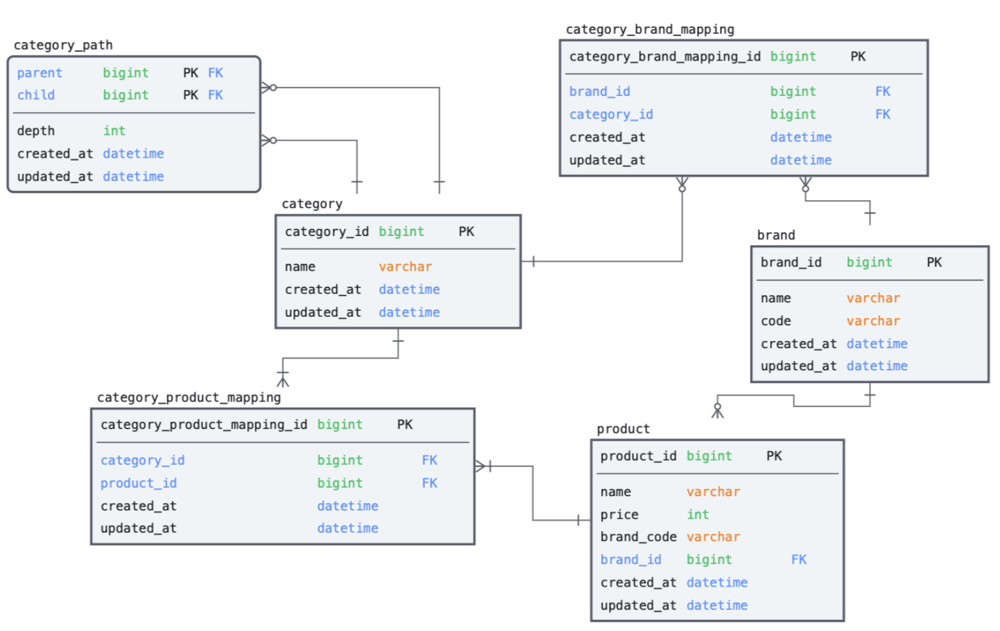

# 202406-musinsa

# 시스템 요구 사항
1. 카테고리 별 최저가격 브랜드와 상품 가격, 총액을 조회하는 API
2. 단일 브랜드로 모든 카테고리 상품을 구매할 때 최저가격에 판매하는 브랜드와 카테고리의 상품가격, 총액을 조회하는 API
3. 카테고리 이름으로 최저, 최고 가격 브랜드와 상품 가격을 조회하는 API
4. 브랜드 및 상품을 추가 / 업데이트 / 삭제하는 API

# 해결 방안
## 테이블 설계

- 무신사 홈페이지를 참고하여 Category Depth를 고려한 설계
- M:N 관계에 대한 Mapping Table 설계

## 문제 해결 전략 및 분석한 내용
1. 도메인 확장 가능성을 고려한 Hexagonal architecture 구현
2. 테스트 커버리지 67%
   - Jacoco Plugin 활용한 Test Limit 제한 (65%) 
   - Test Profile DB 격리 및 Persistence Level Test
   - Mvc Mock API Test
3. Category Depth를 고려한 Category 생성 구현
   - Root Category, Sub Category의 구분
4. Product, Brand CUD 구현
5. Controller Advisor 전역 에러 처리 
6. @OneToMany 연관관계 제거 및 수동 Mapping 처리
7. JPA Auditing 적용 및 BaseEntity 분리
8. `getAll~` 로직에 대한 Caching 적용 (예정)


## Build
```./gradlew clean build```

## Run

```java -jar build/libs/shop-0.0.1-SNAPSHOT.jar ```

## Test

```./gradlew build test```

## 개선 사항 (미구현)
- 검색시 많은 연관관계 Join으로 인한 성능 저하를 고려해 CQRS 도입 
- 검색 Table 데이터 Sync를 위한 Batch 필요
- 최고가, 최저가 검색을 위한 별도의 테이블 구현 
